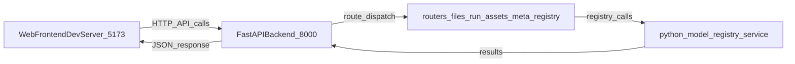
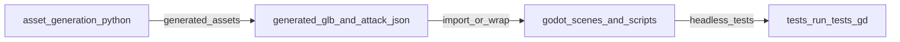

# Data Flows

High-value data flows for AI agents working in this repository.

## Asset editor request flow

## Godot and asset pipeline flow

## Operational notes

- Frontend and backend are started together by `task editor` / `bash asset_generation/web/start.sh`.
- Backend router modules are part of one app process (`main:app`), not independent services.
- Generated assets should not be modified casually; regenerate intentionally when needed.
