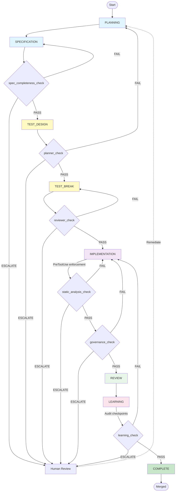

# Milestone 902: Agent Predictability Improvements

**Status:** COMPLETE (gatekeeper sign-off M902-17, 2026-05-22)  
**Closed:** M902-18 parent unblocked after M902-18a framework integration (2026-05-22)

---

## Overview

Milestone 902 delivered an eight-stage governance pipeline, context-optimization middleware, and API contract safety gates for multi-agent workflows in blobert.

**Outcomes:**
1. Validation gate framework and per-stage gates (M902-01–08, 09–16)
2. Static analysis orchestration in **shadow** mode (blocking enforcement → M903)
3. Tool categorization, forgiving parsing, todo/handoff/budget/early-stop tooling (M902-18–23)
4. OpenAPI → TypeScript, Pydantic + Zod pilot, contract tests, pre-commit hook (M902-24–27)

**Authoritative closure checklist:** [17_final_validation_and_stage_integration.md](project_board/902_milestone_902_agent_predictabilitiy_improvements/02_complete/17_final_validation_and_stage_integration.md) (M902-17).  
**Checkpoint index:** [CHECKPOINTS.md](project_board/CHECKPOINTS.md).

---

## Tickets (all in `02_complete/`)

| ID | Topic |
|----|--------|
| 01 | Validation gate framework |
| 02 | Static analysis gate tooling (shadow) |
| 03–08 | Handoff governance, PreToolUse, audit, visualization, per-stage gates |
| 09–16 | Stages 0–8 (diff classify → security) |
| 17 | Final validation & stage integration |
| 18 / 18a | Tool categorization layer + framework integration |
| 19–23 | Forgiving tool parsing, todo validation, context budget, early-stop, atomic handoff |
| 24–27 | OpenAPI → TS, Pydantic + Zod pilot, API contract tests, pre-commit hook |

`00_backlog/`, `01_in_progress/`, and `03_blocked/` contain no open M902 tickets (`.keepfile` only).

---

## Workflow Diagram and Agent Gating

The eight-stage pipeline with validation gates ensures deterministic agent handoffs and multi-layer governance enforcement. Each stage transition is guarded by one or more gates; gates produce PASS (advance), FAIL (return to agent), WARN (advisory), or ESCALATE (human review) outcomes. PreToolUse enforcement (M902-05) intercepts commands during implementation; governance audit (M902-07) provides operational visibility.



---

## Running Static Analysis Gate

### Shadow Mode (Advisory, Non-Blocking)

```bash
# Via Taskfile (recommended)
task hooks:static-analysis

# Via gate runner
python ci/scripts/gate_runner.py static_analysis_check --mode shadow

# Direct invocation
python ci/scripts/gates/static_analysis_check.py
```

---

## How to Run Gates Locally

Gates are executable validation checkpoints that verify spec completeness, code quality, governance compliance, and workflow health. The gate runner (`ci/scripts/gate_runner.py`) is the primary interface for running gates in both development and CI environments.

**Quick Start:**

```bash
python ci/scripts/gate_runner.py spec_completeness_check \
  --upstream-agent Spec \
  --downstream-agent TestDesigner \
  --ticket-id M902-08 \
  --mode shadow

python ci/scripts/gate_runner.py static_analysis_check \
  --upstream-agent Implementation \
  --downstream-agent StaticQA \
  --ticket-id M902-02 \
  --mode blocking

python ci/scripts/gate_runner.py governance_check \
  --upstream-agent Implementation \
  --downstream-agent StaticQA \
  --ticket-id M902-03 \
  --mode shadow \
  --output-dir ./gate-results
```

**Execution Modes:**

*Shadow Mode* (default, non-blocking): Runs the gate and produces a structured JSON report with violations, warnings, and remediation hints. Returns exit code 0 regardless of findings. Use for visibility and guidance during development. Violations are logged but do not block advancement.

*Blocking Mode* (enforcement): Runs the gate with enforcement enabled. Returns exit code 0 if PASS, exit code 1 if FAIL or ESCALATE. Use in CI pipelines and pre-push workflows where violations should prevent advancement. Useful for strict governance in production deployments.

**Decision Tree: What to Do When You Get a Gate Result**

| Outcome | Meaning | Action |
|---------|---------|--------|
| **PASS** | Gate validation succeeded; all checks green | Proceed to next stage; no remediation needed |
| **WARN** | Gate detected non-critical issues; advisory findings | Review findings for best-practice improvements; safe to proceed |
| **FAIL** | Gate detected critical violations; must remediate | Read violation details and remediation hints; fix issues; re-run gate to verify |
| **ESCALATE** | Gate detected high-risk findings requiring review | Stop; create checkpoint entry; route to human reviewer or governance board |

**Gate Artifacts and Output:**

Each gate run produces a JSON result file in `gate-results/` (or custom `--output-dir`) with this structure:

```json
{
  "gate_name": "static_analysis_check",
  "status": "FAIL",
  "timestamp": "2026-05-16T10:23:45Z",
  "violations": [
    {
      "file": "asset_generation/python/src/model_registry.py",
      "line": 42,
      "rule": "bare_except",
      "message": "Bare except clause detected (exception safety violation)",
      "severity": "ERROR"
    }
  ],
  "remediation_hints": ["Add specific exception types to except clauses", "See governance rule G002"],
  "upstream_agent": "Implementation",
  "downstream_agent": "StaticQA"
}
```

Use the `violations` array to identify issues; use `remediation_hints` to guide fixes. Link output files in checkpoint logs for audit trail ([see checkpoints](project_board/checkpoints/)).

**Example Workflow:**

1. Complete implementation and run `python ci/scripts/gate_runner.py static_analysis_check --upstream-agent Implementation --downstream-agent StaticQA --ticket-id M902-02 --mode shadow`
2. Review JSON output; if FAIL, examine violations and fix code issues
3. Re-run gate in shadow mode to verify fixes
4. When satisfied, advance to next stage
5. In CI, run same gate in blocking mode to enforce rules

**Detailed Gate Specifications:**
- [spec_completeness_check](project_board/specs/902_06_spec_gate_spec.md)
- [static_analysis_check](project_board/specs/902_02_static_analysis_gate_spec.md)
- [governance_check](project_board/specs/902_03_handoff_governance_spec.md)
- [planner_check](project_board/specs/902_06_planner_gate_spec.md)
- [reviewer_check](project_board/specs/902_06_reviewer_gate_spec.md)
- [learning_check](project_board/specs/902_06_learning_gate_spec.md)

See the Gate Reference section below for per-gate details on inputs, outputs, and decision logic.

---

## Gate Reference

This section documents the six validation gates that enforce workflow quality and governance: **spec_completeness_check**, **static_analysis_check**, **governance_check**, **planner_check**, **reviewer_check**, and **learning_check**. Each gate has a defined purpose, input schema, artifact outputs, and decision logic for PASS/FAIL/WARN/ESCALATE outcomes.

**spec_completeness_check:** Validates that specification documents contain all required sections (purpose, inputs, outputs, decision logic, error handling, test strategy) before the spec advances to TEST_DESIGN stage. Compares against templates (destructive_api_spec_template.md) for destructive APIs, randomness features, and load-open flows. Prevents incomplete specs from blocking downstream Test Designers and ensures consistent spec quality across the organization. Returns PASS if all sections present and non-empty, FAIL if missing sections or malformed markdown, ESCALATE if spec file unreadable.

**static_analysis_check:** Orchestrates mandatory static analysis tools to detect code quality, security, and style violations before implementation agents advance. Python tools: ruff (linting), mypy (type checking), bandit (security), vulture (dead code), import-linter (architecture), semgrep (semantic analysis), wemake (styleguide). TypeScript tools: eslint, typescript-eslint, react-hooks, sonarjs, boundaries. Godot tools: gdformat, gdlint. Cross-repo tools: jscpd (duplication detection). Runs in shadow mode during M902 (non-blocking, advisory); blocking enforcement deferred to M903.

**governance_check:** Enforces thirty-plus governance rules across six categories: architecture (dependency direction, layer boundaries), exception safety (bare except, silent swallowing), reflection safety (getattr/setattr scoping), async safety (blocking I/O in async contexts), observability (structured logging), and governance integrity (bypass prevention). Detects rule violations with suppression mechanics (# noqa, # type: ignore with issue links). Returns PASS if rules satisfied or suppressions valid, FAIL if unsuppressed violations, WARN if suppressions valid, ESCALATE if bypass attempt detected.

**planner_check:** Detects cyclic dependencies, self-loops, and orphaned tickets in milestone dependency graphs using depth-first search (DFS) cycle detection. Parses ticket YAML metadata for dependencies field, builds directed graph, identifies cycles with node paths, detects orphaned tickets with no incoming/outgoing dependencies. Prevents logical workflow deadlocks and ensures all tickets have clear upstream dependencies for proper sequencing.

**reviewer_check:** Scans staged git changes for undocumented TODO/FIXME/HACK/XXX/KLUDGE comments and unsuppressed linter directives without issue links (# noqa, # pylint: disable, etc.). Gracefully handles unavailable git in non-VCS environments. Prevents accumulation of technical debt and orphaned workarounds that lack traceability to bugs or feature requests.

**learning_check:** Scans learning output files under project_board/checkpoints/ for forbidden phrases (hack, temporary, XXX, KLUDGE, workaround) defined by YAML policy or built-in defaults. Prevents codifying hacks and workarounds in documented learning; ensures checkpoint content focuses on decision rationale and forward-looking improvements rather than temporary workarounds. Returns PASS if no forbidden phrases, WARN if documented with rationale, FAIL if undocumented phrases, ESCALATE if policy file missing.

Each gate is designed as an enforcement point in the multi-agent pipeline. Gates receive input from the upstream agent's work products (specs, code, test output, checkpoints) and apply rules to verify quality, completeness, and compliance. Gate outcomes determine handoff success: PASS allows advancement to the next stage and downstream agent; FAIL routes the ticket back to the upstream agent with detailed violation and remediation information; WARN indicates non-critical findings that do not block advancement; ESCALATE signals high-risk violations requiring human review and decision. All gate results are emitted as structured JSON reports with violation details, remediation hints, and audit metadata for traceability.

**Gate Specifications:**
- [spec_completeness_check: 902_06_spec_gate_spec.md](project_board/specs/902_06_spec_gate_spec.md)
- [static_analysis_check: 902_02_static_analysis_gate_spec.md](project_board/specs/902_02_static_analysis_gate_spec.md)
- [governance_check: 902_03_handoff_governance_spec.md](project_board/specs/902_03_handoff_governance_spec.md)
- [planner_check: 902_06_planner_gate_spec.md](project_board/specs/902_06_planner_gate_spec.md)
- [reviewer_check: 902_06_reviewer_gate_spec.md](project_board/specs/902_06_reviewer_gate_spec.md)
- [learning_check: 902_06_learning_gate_spec.md](project_board/specs/902_06_learning_gate_spec.md)

#### spec_completeness_check

**Purpose:** Validates that a specification document contains all required sections for its declared ticket type (API, Destructive, Randomness, Load-Open, or Generic). Runs before TEST_DESIGN stage to prevent incomplete specs from entering design phase.

**Inputs:** spec_file (path to .md spec), ticket_type (enum: api, destructive, randomness, load-open, generic)

**Artifacts:** JSON violation report with missing sections, severity levels, and references to template requirements

**Outputs:** PASS (spec complete), FAIL (missing required sections), ESCALATE (malformed spec document)

**Decision Logic:** Parse spec markdown for required headers based on ticket_type. Compare against template in [destructive_api_spec_template.md](agent_context/agents/common_assets/destructive_api_spec_template.md). If all required sections present (non-empty content), return PASS. If sections missing or malformed, return FAIL with list of missing sections. If spec file unreadable or invalid markdown, return ESCALATE.

**Specification:** [902_06_spec_gate_spec.md](project_board/specs/902_06_spec_gate_spec.md)

**Troubleshooting:** Ensure spec .md file exists and is readable; verify ticket_type matches ticket content; compare against template structure in agent_context/agents/common_assets/ if sections appear incomplete.

---

#### static_analysis_check

**Purpose:** Orchestrates mandatory static analysis tools (ruff, mypy, bandit, vulture, import-linter, semgrep for Python; eslint + plugins for TypeScript; gdformat, gdlint for Godot; jscpd for duplication) to detect code quality, security, and style violations. Runs in shadow mode during M902; blocking enforcement deferred to M903.

**Inputs:** optional mode (shadow/blocking), ticket_id (for audit logging), upstream_agent (name), downstream_agent (name), output_dir (for artifacts)

**Artifacts:** Aggregated JSON report per tool with file paths, line numbers, rule IDs, severity (ERROR/WARNING/INFO), and auto-remediation hints (where available). Summary JSON lists all violations across tools with counts by category.

**Outputs:** PASS (no violations), WARN (low-severity findings, informational), FAIL (critical violations in blocking mode), ESCALATE (tool integration failures or security findings)

**Decision Logic:** Invoke each tool in sequence (Python → TypeScript → Godot → Duplication). Aggregate violations by severity. In shadow mode, return PASS regardless of findings (for visibility). In blocking mode, return PASS only if no ERROR-severity violations; return FAIL if ERRORs detected; return WARN if WARNINGs only; return ESCALATE if tool failure or security risk detected. Link remediation to tool-specific documentation.

**Specification:** [902_02_static_analysis_gate_spec.md](project_board/specs/902_02_static_analysis_gate_spec.md)

**Troubleshooting:** Verify all tools installed (ruff, mypy, bandit, semgrep, eslint, gdformat, jscpd). Check tool configs in pyproject.toml, eslint.config.js, jscpd.json. Run tools directly to verify setup; check tool versions match CI expectations. Review tool_audit.md for known limitations.

---

#### governance_check

**Purpose:** Enforces 30+ governance rules across six categories (architecture, exception safety, reflection safety, async safety, observability, governance integrity) to prevent anti-patterns and unsafe code. Detects bypass attempts and documents suppressions.

**Inputs:** optional mode (shadow/blocking), ticket_id (for audit), upstream_agent (name), downstream_agent (name), repo_root (for file scanning)

**Artifacts:** JSON violation report per rule (rule_id, file, line, message, suppression_status). Summary includes rule categories, suppression counts, and bypass detection alerts.

**Outputs:** PASS (all rules satisfied or suppressions valid), WARN (suppressed violations), FAIL (unsuppressed rule violations), ESCALATE (bypass attempt or suppression tampering detected)

**Decision Logic:** Scan modified files for rule violations (e.g., bare except, circular imports, blocking I/O in async). Check for valid suppressions (# noqa, # type: ignore with issue link). If any unsuppressed violations, return FAIL. If suppressions valid but violations present, return WARN. If suppression appears tampered or bypass detected, return ESCALATE. Document all suppressions in audit log.

**Specification:** [902_03_handoff_governance_spec.md](project_board/specs/902_03_handoff_governance_spec.md)

**Troubleshooting:** Run governance_check with verbose output to see rule details. Check suppression format (must include issue link in comment). Review rule definitions in gate implementation. Verify file paths match repo root. For bypass questions, escalate to governance board.

---

#### planner_check

**Purpose:** Detects cyclic dependencies, self-loops, and orphaned tickets in milestone dependency graphs. Prevents logical workflow deadlocks and ensures all tickets have clear upstream dependencies.

**Inputs:** optional milestone_path (path to milestone folder with ticket .md files)

**Artifacts:** Dependency graph JSON (nodes=tickets, edges=dependencies), cycle detection output with node paths, orphan list

**Outputs:** PASS (acyclic, all tickets connected), FAIL (cycle detected or orphaned ticket), ESCALATE (malformed dependency metadata)

**Decision Logic:** Parse ticket YAML metadata for dependencies field. Build directed graph. Run DFS-based cycle detection. If cycles found, return FAIL with cycle path. If orphaned tickets (no incoming/outgoing dependencies), return FAIL. If dependency metadata malformed, return ESCALATE. Otherwise PASS.

**Specification:** [902_06_planner_gate_spec.md](project_board/specs/902_06_planner_gate_spec.md)

**Troubleshooting:** Verify ticket YAML has dependencies field (can be empty). Check dependency IDs match actual ticket names. Run planner_check with milestone_path pointing to correct folder. For complex cycles, visualize dependency graph from output JSON.

---

#### reviewer_check

**Purpose:** Scans staged git changes for undocumented TODO/FIXME/HACK/XXX/KLUDGE comments and unsuppressed linter directives (# noqa, # pylint, etc.) without issue links. Prevents accumulation of technical debt and orphaned workarounds.

**Inputs:** optional repo_path (git repository root)

**Artifacts:** JSON report with comment locations (file, line), comment text, suppression status, linked issue IDs

**Outputs:** PASS (all comments documented with issue links), WARN (comments present but suppressions valid), FAIL (undocumented comments or suppressions without links), ESCALATE (git unavailable)

**Decision Logic:** Run `git diff --cached` to find staged changes. Scan lines for comment patterns (TODO, FIXME, HACK, etc.). Check for issue link in comment or valid suppression. If undocumented comments found, return FAIL. If suppressions present without links, return FAIL. If git unavailable, return ESCALATE gracefully. Otherwise PASS.

**Specification:** [902_06_reviewer_gate_spec.md](project_board/specs/902_06_reviewer_gate_spec.md)

**Troubleshooting:** Ensure git repository is initialized and clean (no untracked files blocking diff). Stage changes with `git add` before running gate. Issue links in comments should follow format `# TODO: fix X (issue: #123)` or `# noqa: E501 # issue: #456`. If git unavailable, skip this gate in non-git environments.

---

#### learning_check

**Purpose:** Scans learning output files under `project_board/checkpoints/` for forbidden phrases (hack, temporary, XXX, KLUDGE, workaround) that indicate undocumented workarounds. Prevents technical debt from being codified in decision rationale and ensures checkpoint content is focused on learning and forward-looking improvements.

**Inputs:** optional checkpoints_dir (path to checkpoint directory), policy_file (YAML with forbidden patterns; uses defaults if not provided)

**Artifacts:** JSON report of forbidden phrase occurrences (file, line, phrase, context)

**Outputs:** PASS (no forbidden phrases in checkpoint files), WARN (phrases present but documented with rationale), FAIL (undocumented forbidden phrases in learning output), ESCALATE (checkpoints directory inaccessible)

**Decision Logic:** Load forbidden phrase policy (YAML file or built-in defaults: hack, temporary, XXX, KLUDGE, workaround). Scan all .md files in project_board/checkpoints/. For each phrase match, check context for documented rationale. If match without explanation, return FAIL. If matches documented (e.g., with comment explaining the workaround), return WARN. If checkpoints directory inaccessible, return ESCALATE. Otherwise PASS.

**Specification:** [902_06_learning_gate_spec.md](project_board/specs/902_06_learning_gate_spec.md)

**Troubleshooting:** Verify checkpoints_dir exists and is readable. Ensure checkpoint .md files exist under project_board/checkpoints/. If using custom policy file, verify YAML syntax. Document workarounds in checkpoint files with inline comments explaining rationale and issue references. Built-in policy detects: hack, temporary, XXX, KLUDGE, workaround.

---

## Configuration

- **Python tools:** `asset_generation/python/pyproject.toml`
- **Semgrep rules:** `asset_generation/python/.semgrep.yml`
- **ESLint config:** `asset_generation/web/frontend/eslint.config.js`
- **jscpd config:** `jscpd.json`

---

## Exclusions (per CLAUDE.md)

- `*.glb`, `*_export.png`, `*_bake.png` (generated artifacts)
- `.venv/`, `node_modules/`, `.godot/`, `__pycache__/`
- `reference_projects/` (read-only)
- Build artifacts: `dist/`, `build/`, `.next/`, `out/`

---

## Tool Categorization: When & How to Declare Category (M902-18)

Agents may declare a workflow category so invocation middleware passes a smaller tool schema (~15–25% reduction vs. all tools). **Optional** — omitting a declaration receives all tools (backward compatible).

**Implementation:** `ci/scripts/tool_category_manager.py`, `ci/scripts/agent_invocation_middleware.py` (`invoke_agent_with_category_filtering`), config `ci/scripts/tool_categories.json`.

### Choose a category

| Goal | Category |
|------|----------|
| Read code, explore, write specs | `parse` |
| Edit or write files | `modify` |
| Run tests, verify behavior | `test` |
| Decompose work, todos, git history | `plan` |
| Analysis, subagents, broad read | `think` |

### Prompt syntax (any one format)

```text
I declare tool category: parse
My workflow category is: modify
Tool category: test
```

### Examples

- **Spec Agent (parse):** `I declare tool category: parse` — read/explore before writing the spec.
- **Implementation Agent (modify):** `My workflow category is: modify` — edit/write implementation files.
- **Test Designer (test):** `Tool category: test` — run test harnesses and validate behavior.

### Fallback and troubleshooting

- If a category hides a tool you need, declare a broader category (e.g. `think`) and note the constraint in the scoped checkpoint log.
- Invalid or missing category names log a warning and fall back to **all tools** (fail-safe).
- Measure reduction locally: `uv run python -c "from ci.scripts.tool_category_manager import measure_tool_schema_reduction; print(measure_tool_schema_reduction('parse'))"` from repo root with `UV_PROJECT=asset_generation/python`.

**Spec:** [902_18_tool_categorization_spec.md](project_board/specs/902_18_tool_categorization_spec.md) · **Integration guide:** [checkpoints/M902-18/INTEGRATION_GUIDE.md](project_board/checkpoints/M902-18/INTEGRATION_GUIDE.md)

---

## Documentation References

- Tool audit: [902_02_tool_audit.md](project_board/specs/902_02_tool_audit.md)
- Baseline report: [902_02_tool_baseline_report.md](project_board/specs/902_02_tool_baseline_report.md)
- Specification: [902_02_static_analysis_gate_spec.md](project_board/specs/902_02_static_analysis_gate_spec.md)
- Test suite: [test_static_analysis_gate.py](tests/ci/test_static_analysis_gate.py)

---

## Next Steps (M903)

1. Define enforcement thresholds per tool
2. Implement grandfathering policies
3. Auto-remediation integration
4. CI/pre-push workflow integration
5. Team adoption and rollout
