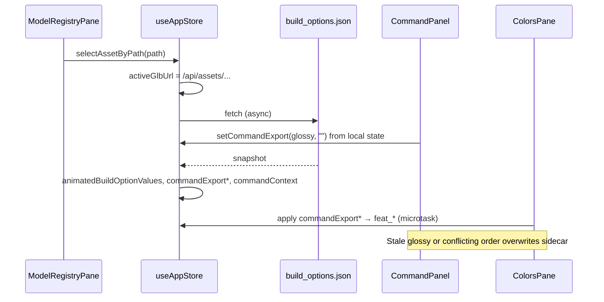

# BUG: UI configs/colors/settings on model load

## Bug Report
the current model configs, colors, and settings are being set in the ui when the model loads.

## Acceptance Criteria
- The specific error no longer occurs
- A regression test exists that would have caught this bug
- All pre-existing tests continue to pass

## Diagnosis

### Root cause (one line)
Every preview load calls `selectAssetByPath` → `hydrateBuildOptionsFromPreviewGlbPath`, which overwrites global editor state from the GLB sidecar while `CommandPanel` keeps unrelated local `finish`/`hexColor` state that re-pushes into the store and `ColorsPane`.

### Responsible code

| Location | Lines (approx.) | Incorrect behavior |
|----------|-----------------|-------------------|
| `asset_generation/web/frontend/src/store/useAppStore.ts` | `selectAssetByPath` (315–323), `hydrateBuildOptionsFromPreviewGlbPath` (325–359) | **Unconditional** sidecar import on every preview path change: replaces `animatedBuildOptionValues[slug]`, patches `commandExportFinish` / `commandExportHexColor`, and mutates `commandContext` (including forcing `cmd: "player"` + color from filename). |
| `asset_generation/web/frontend/src/components/CommandPanel/CommandPanel.tsx` | local state 100–101; effect 129–132 | `finish` / `hexColor` are **component-local** (default `"glossy"` / `""`). Effect always writes local → `commandExport*`; never reads store after hydration. Can overwrite sidecar-derived export fields on mount/re-render. |
| `asset_generation/web/frontend/src/components/Preview/ColorsPane.tsx` | effect 36–60 | When Colors tab is visible, `queueMicrotask` copies `commandExport*` into `feat_*` zone keys for zones still at defaults — amplifies stale command-bar values after a model load. |
| Call sites (all trigger hydration) | `ModelRegistryPane.tsx` 285, 555, 755; `BuildControls.tsx` 242, 256; `useAppStore.ts` `refreshAssetsAndAutoSelect` 378 | Registry version preview, load-existing open, enemy/player preview sync, and post-run auto-select all mutate UI settings, not only `activeGlbUrl`. |

### Correct behavior (target)

1. **Preview vs import:** Changing the preview GLB (`activeGlbUrl`) must **not** by itself replace the user’s in-session build options, per-zone colors, or command-bar finish/hex — unless the action is explicitly an **import settings from model** flow (see Spec).
2. **When settings import is intended** (e.g. after generation completes, or an explicit registry “open with settings” action): all UI surfaces must show the same values from `*.build_options.json` — store, CommandPanel local fields, Build tab, and Colors tab — with no race where defaults win over the sidecar.
3. **Registry version preview** and **BuildControls** auto-path correction should update the **3D preview only** (URL + clip reset), preserving the editor’s current procedural settings for the next run/regenerate.

### Evidence chain

## Spec

### Requirement REQ-1: Preview load does not import UI settings

#### 1. Spec Summary
- **Description:** `selectAssetByPath` (and any wrapper used for preview-only navigation) must update preview-related store fields only: `activeGlbUrl`, reset `availableClips` / `activeAnimation` / `isAnimationPaused` as today. It must **not** call `hydrateBuildOptionsFromPreviewGlbPath` unless an explicit import flag or dedicated action requests it.
- **Constraints:** Applies to `ModelRegistryPane.previewVersion`, `onPreviewVersion`, and `BuildControls` preview-sync `selectAssetByPath` calls. Does not remove sidecar fetch utility — only decouple from default preview path.
- **Assumptions:** Bug report means editor UI must stay stable when the user only changes which GLB is shown in the canvas (word “current” read as “in-session / user’s working” settings, not “loaded model’s” settings).
- **Scope:** `asset_generation/web/frontend` store + registry/build preview callers.

#### 2. Acceptance Criteria
- AC-1.1: With `animatedBuildOptionValues.spider.eye_count = 7` and command export `finish = matte`, calling preview for `animated_exports/spider_animated_05.glb` (with a differing sidecar) leaves `eye_count` and `commandExportFinish` unchanged in store.
- AC-1.2: `activeGlbUrl` still updates to the selected GLB path (cache-bust query param allowed).
- AC-1.3: Regression test covers registry-style `selectAssetByPath` without import (mock sidecar fetch; assert store build row unchanged).

#### 3. Risk & Ambiguity Analysis
- **Risk:** Product may have intended “preview version shows that export’s settings.” Mitigation: add explicit **Import settings from preview** later; out of scope unless AC updated.
- **Edge:** GLB with no sidecar — no store change (same as today after fix).
- **Edge:** Switching `commandContext` enemy via BuildControls — still may change preview path; must not import sidecar under REQ-1.

#### 4. Clarifying Questions
- Should **Load existing → Open** import sidecar settings (REQ-2) or preview-only? **Assumed yes** (user is opening a saved model into the workflow).

---

### Requirement REQ-2: Explicit import paths still apply sidecar

#### 1. Spec Summary
- **Description:** Flows that should align UI with an on-disk export must call a dedicated import API (e.g. `selectAssetByPath(path, { importBuildOptions: true })` or `importBuildOptionsFromPreviewGlbPath(path)` after preview select). Minimum explicit importers: `refreshAssetsAndAutoSelect` after a successful generation run; `ModelRegistryPane.openExistingSelection` after successful open.
- **Constraints:** Import uses existing `fetchBuildOptionsSidecarForGlbPath` + `replaceAnimatedSlugBuildOptionsRow` + `commandExportPatchFromBuildSnapshot` + player `commandContext` rules in `hydrateBuildOptionsFromPreviewGlbPath`.
- **Assumptions:** Post-run auto-select should continue to load the new export’s settings into the editor.
- **Scope:** Same files as REQ-1; registry open-existing only (not version preview click).

#### 2. Acceptance Criteria
- AC-2.1: After `refreshAssetsAndAutoSelect(outputFile)` with a mocked sidecar `{ eye_count: 4 }`, store row for that slug includes `eye_count: 4`.
- AC-2.2: After `openExistingSelection` success (mocked API + `selectAssetByPath` with import), store reflects mocked sidecar fields.
- AC-2.3: Registry **preview version** (REQ-1) does **not** satisfy AC-2.1 unless import flag is set.

#### 3. Risk & Ambiguity Analysis
- **Risk:** Open-existing without sidecar — import no-ops; preview URL still updates.
- **Edge:** `animatedBuildControls[slug]` empty (meta not loaded) — hydrate early-returns today; preserve that guard.

#### 4. Clarifying Questions
- None blocking; REQ-2 default import list is conservative.

---

### Requirement REQ-3: CommandPanel reflects store after import

#### 1. Spec Summary
- **Description:** When `commandExportFinish` / `commandExportHexColor` are updated by the store (import or `setCommandExport`), CommandPanel **visible** finish select and hex inputs must match the store. Local state must not push defaults over imported values on mount.
- **Constraints:** No duplicate source of truth long term: prefer subscribing local state to store for `animated`/`player` cmds, or one-time sync when store export fields change.
- **Assumptions:** REQ-3 matters only when REQ-2 import runs; still required to fix inconsistent UI if import is re-enabled for any path.
- **Scope:** `CommandPanel.tsx` (+ tests).

#### 2. Acceptance Criteria
- AC-3.1: Store `commandExportFinish: "metallic"`, `commandExportHexColor: "#aabbcc"` → rendered finish select shows `metallic` and hex field `#aabbcc` without user interaction.
- AC-3.2: After import sets store export fields, the effect at CommandPanel 129–132 does not revert them to `"glossy"` / `""` on the next commit.
- AC-3.3: User changing finish in CommandPanel still updates store (existing behavior).

#### 3. Risk & Ambiguity Analysis
- **Edge:** Invalid hex in store — color input fallback `#7ab8ff` display-only rule unchanged.
- **Edge:** `cmd` not `animated`/`player` — export fields ignored (unchanged).

#### 4. Clarifying Questions
- None.

---

### Requirement REQ-4: ColorsPane does not apply stale command export after preview-only load

#### 1. Spec Summary
- **Description:** With REQ-1, ColorsPane must not overwrite `feat_*` from `commandExport*` solely because `activeGlbUrl` changed. When REQ-2 import runs, zone hydration may run **after** store holds imported `feat_*` and matching `commandExport*` (ordering: import completes before Colors microtask, or skip command-bar hydration when snapshot already populated all zones).
- **Constraints:** Preserve existing behavior when user edits command bar while Colors tab is open (see `ColorsPane.test.tsx` re-hydrate on export change).
- **Assumptions:** No assumptions beyond REQ-1/2/3.
- **Scope:** `ColorsPane.tsx` (+ tests).

#### 2. Acceptance Criteria
- AC-4.1: Preview-only `selectAssetByPath` with Colors tab open does not change `animatedBuildOptionValues[slug].feat_body_finish` when sidecar differs from current UI.
- AC-4.2: Import path (REQ-2) with Colors open sets zone finishes to sidecar values (not command-bar defaults).
- AC-4.3: Changing `commandExportFinish` in store while Colors open still updates zones at default per existing tests.

#### 3. Risk & Ambiguity Analysis
- **Risk:** Microtask ordering flakiness in tests — use `act` + awaited import promise as needed.

#### 4. Clarifying Questions
- None.

---

### Requirement REQ-5: Regression and non-regression tests

#### 1. Spec Summary
- **Description:** Add focused frontend unit/integration tests (Vitest + RTL) proving REQ-1 and at least one REQ-2 path; extend CommandPanel/Colors tests for REQ-3/4 as needed.
- **Constraints:** No tests that assert markdown/ticket prose; assert store and DOM state only.
- **Assumptions:** Mock `fetchBuildOptionsSidecarForGlbPath` at module boundary.
- **Scope:** `asset_generation/web/frontend/src/**/*.test.tsx`.

#### 2. Acceptance Criteria
- AC-5.1: New test fails on current `main`/branch behavior (preview imports settings) and passes after fix.
- AC-5.2: `npm test` in `asset_generation/web/frontend` passes.
- AC-5.3: Existing `BuildControls.previewSync.test.tsx` and `ColorsPane.test.tsx` cases remain green (update only if contract intentionally changes).

#### 3. Risk & Ambiguity Analysis
- **Risk:** Over-mocking store — prefer real `useAppStore` with fetch mocked.

#### 4. Clarifying Questions
- None.

---

### Selector mode contract (load-open)
- **Preview selector:** Registry version row / BuildControls enemy sync → **preview-only** (GLB URL only).
- **Open selector:** Load-existing POST success → **preview + import settings** (REQ-2).
- **Mixed behavior rejected:** A single `selectAssetByPath` call must not both preview and conditionally import based on hidden global state; import must be explicit in the call signature.

### Failure taxonomy (load-open)
| Situation | Expected UI behavior |
|-----------|----------------------|
| Sidecar 404 | Preview loads; no import; no error toast required (today silent) |
| Sidecar fetch throw | Preview loads; import aborted; no partial `animatedBuildOptionValues` replace |
| Meta controls empty for slug | Import no-op for build row (existing guard); preview still works |
| User on Colors tab, preview-only | Zone colors unchanged (REQ-4) |

## NEXT ACTION

Implementation frontend agent: decouple `selectAssetByPath` from unconditional `hydrateBuildOptionsFromPreviewGlbPath`; add explicit import flag for REQ-2 paths; make regression test `BUG-model-load-ui-settings-preview-select-does-not-import-sidecar` pass.

## WORKFLOW STATE

| Field | Value |
|---|---|
| Stage | IMPLEMENTATION_FRONTEND |
| Revision | 3 |
| Last Updated By | Test Designer Agent |
| Next Responsible Agent | IMPLEMENTATION_FRONTEND |
| Validation Status | Regression test authored (fails on current code); REQ-3/4 tests deferred to implementation |
| Blocking Issues | None |
