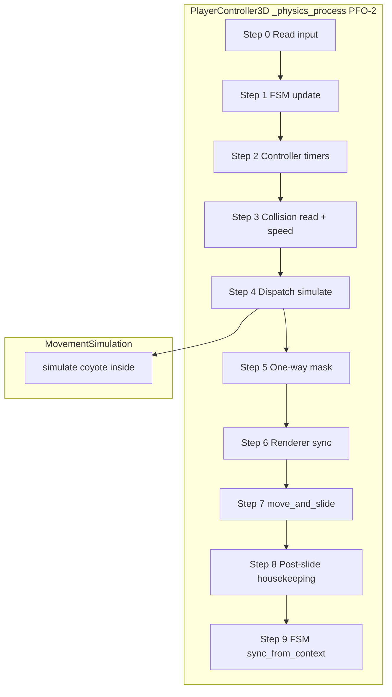

# Player Physics Frame Order Specification

**Ticket:** M11-02 — `02_physics_frame_order.md`  
**Milestone:** M11 Base Mutation Attacks (Prerequisite)  
**Spec revision:** 1  
**Spec exit type:** `generic`  
**Normative ID prefix:** `PFO-*`

---

## Document Summary

Freeze and implement a **normative `_physics_process` pipeline** in `PlayerController3D` so downstream M11 attack tickets can rely on stable phase boundaries for input gating, hitbox queries, and presentation sync.

This ticket is a **non-breaking refactor** of controller frame order plus **net-new jump buffer** (0.1s default). **Coyote time** remains owned by `MovementSimulation` (already implemented and covered by M1 sim tests). **One-way platform collision masks** are greenfield (layer bit map + test fixture). **Renderer/visual sync** is consolidated into an explicit pre-`move_and_slide()` controller step; post-slide juice and FSM derivation follow documented rules.

| Layer | Owner | M11-02 change |
|-------|-------|---------------|
| Gameplay FSM timer | `PlayerStateMachine.update(delta)` | Step 1 — preserved from M11-01 |
| Jump buffer timer | `PlayerController3D` | Step 2 — **new** |
| Coyote timer | `MovementSimulation.simulate()` step 6 | **No move** — document ownership |
| Kinematic dispatch | `MovementSimulation.simulate()` | Step 4 — unchanged sim API |
| One-way mask | `PlayerController3D.collision_mask` | Step 5 — **new** |
| Renderer snapshot | `_sync_renderer_from_state()` | Step 6 — **new/explicit** |
| Collision resolution | `move_and_slide()` | Step 7 — **last** engine move |
| Gameplay FSM derivation | `sync_from_context` | Step 11 — preserved from M11-01 |

**Primary files:** `scripts/player/player_controller_3d.gd`, `scripts/movement/movement_simulation.gd` (read-only except re-export sync of `coyote_time`), `project.godot` (layer names), test fixture scene.

---

## Deferred Boundary Statement

**In scope (M11-02):**

- Normative numbered pipeline in `_physics_process` with in-code step comments matching this spec.
- Jump buffer (`@export jump_buffer_time`, default `0.1`) at controller boundary.
- Coyote time **documentation** and controller→sim wiring preservation (`@export coyote_time` → `_simulation.coyote_time`).
- One-way platform physics layer bit map, player mask rules, minimal test fixture scene.
- `_sync_renderer_from_state()` pre-`move_and_slide()` (controller → visual/animation inputs; no renderer → controller writes).
- Private step extraction: `_tick_controller_timers`, `_dispatch_movement`, `_update_one_way_collision_mask`, `_sync_renderer_from_state`.
- Headless behavior tests (jump buffer, coyote at controller boundary, one-way pass/land, frame-order observables via runtime behavior).

**Out of scope (deferred):**

- **I-frames / invulnerability timers** — ticket mentions iframes; no implementation exists today. Deferred to a future combat ticket; Step 2 documents a **reserved** slot comment only (no timer vars).
- Attack states, ability input gating, hitbox activation — downstream M11 attack tickets.
- Hold-to-float input and float physics.
- Drop-through one-way platforms (down+action); only pass-from-below and land-from-above are in scope.
- Refactoring `MovementSimulation.simulate()` internal step order.
- Moving coyote timer decrement from sim to controller (unless a red test proves ordering bug — default: keep in sim).
- Changing `SlimeVisualState` from `_process` pull to push (optional optimization; not required if child process order satisfies one-way data flow).
- Modifying `reference_projects/` or `3D-Platformer-Kit/`.

---

## Test Strategy

| Tier | Location | Scope |
|------|----------|-------|
| **Primary** | `tests/scripts/player/test_player_physics_frame_order.gd` | Jump buffer landing, coyote walk-off at controller boundary, one-way pass-through from below / land from above, mask rules observable via motion (not call-order logging) |
| **Adversarial** | `tests/scripts/player/test_player_physics_frame_order_adversarial.gd` | Buffer expiry at 0.1s boundary, buffer+coyote interaction, mask flip at `velocity.y == 0`, double-jump via buffer, reorder regressions |
| **Regression** | Existing movement sim suite | `tests/scripts/movement/test_jump_simulation*.gd`, `test_wall_cling_simulation*.gd` — **unchanged behavior** |
| **Gate** | Full suite | `timeout 300 ci/scripts/run_tests.sh` exits 0 at ticket COMPLETE |

**Test realism rules (normative):**

- Assert **runtime behavior** only (position, velocity, `is_on_floor()`, `collision_mask`, jump impulse / vertical velocity sign). Do **not** assert markdown, ticket prose, or log call order unless this spec explicitly defines logging as the contract (it does not).
- Instantiate player via test fixture scene or minimal harness with deterministic physics stepping (`PhysicsServer3D` flush / `_physics_process` loop with fixed `delta`).
- Register both test files in `tests/run_tests.gd`.

**Fixture scene (required):** `scenes/levels/sandbox/test_one_way_platform_3d.tscn`

- Static **ground** body on physics layer bit **1** (`GROUND`).
- Static **one-way** body on physics layer bit **2** (`ONE_WAY`), positioned above a gap so the player can approach from below and from above.
- Player instance from `scenes/player/player_3d.tscn` with default exports unless a test overrides `jump_buffer_time` / `coyote_time`.

---

## Edge Cases (Summary)

| ID | Case | Expected behavior |
|----|------|-------------------|
| EC-1 | Jump pressed in air, lands within 0.1s | First grounded frame executes jump via buffer |
| EC-2 | Jump pressed in air, lands after 0.1s | No buffered jump; normal grounded jump on next press |
| EC-3 | Walk off platform, press jump within coyote window | Jump executes (sim coyote; controller passes prior-frame floor correctly) |
| EC-4 | Walk off platform, press jump after coyote expires | No jump |
| EC-5 | `velocity.y > 0` (ascending) | `collision_mask` excludes `ONE_WAY` bit |
| EC-6 | `velocity.y <= 0` (falling / standing) | `collision_mask` includes `ONE_WAY` bit |
| EC-7 | Ascending through one-way from below | No collision with one-way body; player passes through |
| EC-8 | Falling onto one-way from above | Player lands (`is_on_floor()` true after slide) |
| EC-9 | `jump_buffer_time == 0.0` | Buffer disabled; only raw `jump_just_pressed` applies |
| EC-10 | `enemy_movement_root` active | Jump input suppressed; buffer does not accumulate |
| EC-11 | Same-frame raw press + buffer consume on landing | Single jump only (`jump_consumed` in sim) |
| EC-12 | `move_and_slide()` before mask update | **Invalid** — one-way tests must fail until fixed |
| EC-13 | Renderer sync before simulate completes | **Invalid** — sync uses post-dispatch committed kinematic intent |
| EC-14 | Double `PlayerStateMachine.update` per tick | **Invalid** — timer rate doubled (PSM-3) |

---

# Requirements

---

## Requirement PFO-1: Spec Identity and Regression Contract

### 1. Spec Summary

- **Description:** This document is the single normative contract for M11-02. Implementation must match numbered steps in PFO-2. M1 movement feel is preserved except intentional jump-buffer polish (early jump press before landing).
- **Constraints:** Do not change `MovementSimulation.simulate()` signature or step semantics except passing `effective_jump_just_pressed` from controller. Do not conflate `MovementSimulation.MovementState` with `PlayerStateMachine.PlayerState` (PSM-1).
- **Assumptions:** M11-01 complete (`PlayerStateMachine` wired). Godot 4.x 3D physics, Y-up, `CharacterBody3D.move_and_slide()`.
- **Scope:** `PlayerController3D._physics_process` and directly related controller exports/helpers.

### 2. Acceptance Criteria

- **AC-PFO-1.1:** Every ticket AC maps to at least one PFO requirement (see traceability matrix).
- **AC-PFO-1.2:** Existing M1 movement sim tests remain green without modification unless a documented intentional behavior change (none planned).
- **AC-PFO-1.3:** `timeout 300 ci/scripts/run_tests.sh` exits 0 at ticket COMPLETE.

### 3. Risk & Ambiguity Analysis

- **R-PFO-1.1:** Buffer changes landing-frame jump timing by ≤1 physics tick — acceptable polish per ticket.

### 4. Clarifying Questions

None.

---

## Requirement PFO-2: Normative `_physics_process` Pipeline

### 1. Spec Summary

- **Description:** `_physics_process(delta)` executes the following steps **in order** every physics tick. Each step must appear as a numbered comment in code (`# PFO-2 Step N:`). Extract private methods where noted; no unrelated refactors.
- **Constraints:** `move_and_slide()` occurs exactly once, in Step 7. `_player_state_machine.update(delta)` exactly once in Step 1 (PSM-3). Input read occurs before Step 1.
- **Assumptions:** `is_on_floor()` / `is_on_wall()` at frame start reflect **previous** tick's `move_and_slide()` result (Godot default).
- **Scope:** `scripts/player/player_controller_3d.gd`.

### 2. Acceptance Criteria

- **AC-PFO-2.1 — Step 0 `_read_player_input()`:** Read `input_axis`, `jump_pressed`, `jump_just_pressed`, detach inputs, debug kill (debug build only). If `_enemy_movement_root_remaining > 0`, force `input_axis = 0`, `jump_pressed = false`, `jump_just_pressed = false` (preserve M8 behavior).
- **AC-PFO-2.2 — Step 1 `_player_state_machine.update(delta)`:** Advance gameplay FSM `state_timer` only; no derivation here (PSM-3).
- **AC-PFO-2.3 — Step 2 `_tick_controller_timers(delta)`:** (a) If raw `jump_just_pressed` (after Step 0 suppression): set `_jump_buffer_timer = jump_buffer_time`. (b) Decrement: `_jump_buffer_timer = max(0.0, _jump_buffer_timer - delta)`. (c) Reserved comment slot for future iframes — no vars in M11-02. **Coyote timer is NOT decremented here** (PFO-4).
- **AC-PFO-2.4 — Step 3 `_prepare_frame_collision_state()`:** Read `is_on_floor()`, `is_on_wall()`, wall normal; write `_current_state.is_on_floor`; apply fusion/mutation speed modifiers to `_simulation.max_speed` (preserve existing logic).
- **AC-PFO-2.5 — Step 4 `_dispatch_movement(...)`:** Compute `effective_jump_just_pressed` (PFO-5); call `_simulation.simulate(...)`; map result velocity to 3D; apply `_enemy_movement_root` horizontal clamp; lock `global_position.z` to play plane. Returns/handles `next_state` for downstream steps. **Do not** call `move_and_slide()` here.
- **AC-PFO-2.6 — Step 5 `_update_one_way_collision_mask()`:** Set `collision_mask` from post-dispatch `velocity.y` per PFO-7. Runs **before** Step 7.
- **AC-PFO-2.7 — Step 6 `_sync_renderer_from_state(...)`:** One-way push/read-only snapshot per PFO-8. Uses post-dispatch kinematic intent; **no** gameplay state mutation from renderer nodes.
- **AC-PFO-2.8 — Step 7 `_apply_collision_slide()`:** `move_and_slide()` then repeat `_enemy_movement_root` horizontal velocity clamp if active.
- **AC-PFO-2.9 — Step 8 `_post_slide_housekeeping(...)`:** Land edge juice (`_juice_land_squash` when `is_on_floor()` and not prior `_current_state.is_on_floor`); copy `next_state` fields into `_current_state` (velocity, coyote_timer, jump_consumed, wall cling, hp); chunk slot processing; enemy acid DoT tick; decrement `_enemy_movement_root_remaining`.
- **AC-PFO-2.10 — Step 9 `_sync_player_state_machine()`:** Build `PlayerStateDerivationContext` from post-slide engine state; `sync_from_context` (PSM-10). Runs **after** Step 7.
- **AC-PFO-2.11:** In-code step comments match PFO-2 step numbers and names.

### 3. Risk & Ambiguity Analysis

- **R-PFO-2.1:** Large diff — restrict to pipeline reorder + extracted methods; no chunk/infection refactors.
- **R-PFO-2.2:** Land squash in Step 8 (post-slide) is intentional: landing is unknowable until collision resolves; Step 6 must not depend on post-slide `is_on_floor()`.

### 4. Clarifying Questions

None.

---

## Requirement PFO-3: Jump Buffer Configuration

### 1. Spec Summary

- **Description:** Add jump input buffering at the controller boundary so a jump pressed up to `jump_buffer_time` seconds before landing still executes on the first grounded frame.
- **Constraints:** Default `0.1` seconds. Independent from coyote logic inside sim. Negative `jump_buffer_time` is undefined behavior; treat as `0.0` (disabled).
- **Assumptions:** Buffer coexists with existing sim jump/coyote/wall-jump rules.
- **Scope:** `PlayerController3D` exports and Step 2 timer tick.

### 2. Acceptance Criteria

- **AC-PFO-3.1:** `@export var jump_buffer_time: float = 0.1` on `PlayerController3D`.
- **AC-PFO-3.2:** Private var `_jump_buffer_timer: float = 0.0`, reset appropriately on `reset_hp()` / `reset_position()` (clear to `0.0`).
- **AC-PFO-3.3:** When `jump_buffer_time == 0.0`, buffer never sets and behavior matches pre-M11-02 (raw press only).
- **AC-PFO-3.4:** Behavioral test: airborne press → land before expiry → upward jump on landing frame.

### 3. Risk & Ambiguity Analysis

- **R-PFO-3.1:** Buffer + coyote on same frame — sim precedence unchanged; regular jump eligibility in sim decides (PFO-5).

### 4. Clarifying Questions

None.

---

## Requirement PFO-4: Coyote Time Ownership

### 1. Spec Summary

- **Description:** Coyote time behavior remains in `MovementSimulation` (SPEC-19 / steps 6 and 11 in sim). Controller continues to mirror `@export var coyote_time: float = 0.1` into `_simulation.coyote_time` in `_ready()` and when export changes if applicable.
- **Constraints:** Do **not** duplicate coyote decrement in controller Step 2. Do **not** move coyote eligibility out of sim without a spec revision.
- **Assumptions:** M1 sim tests remain authoritative for coyote math.
- **Scope:** Documentation + wiring preservation.

### 2. Acceptance Criteria

- **AC-PFO-4.1:** Controller Step 2 does not read or write `_current_state.coyote_timer` except via sim output copy-back in Step 8.
- **AC-PFO-4.2:** `_simulation.coyote_time` defaults to `0.1` via controller export (unchanged from today).
- **AC-PFO-4.3:** Behavioral controller test: walk off ledge, press jump within 0.1s → jump occurs (vertical velocity upward after dispatch).

### 3. Risk & Ambiguity Analysis

- **R-PFO-4.1:** Controller passes `prior_state.is_on_floor` from engine at frame start; first airborne frame still has coyote from sim reset on last grounded frame — matches M1.

### 4. Clarifying Questions

None.

---

## Requirement PFO-5: Effective Jump Input Contract

### 1. Spec Summary

- **Description:** Define the jump press signal passed into `MovementSimulation.simulate()` as `jump_just_pressed` parameter.

```gdscript
var effective_jump_just_pressed := jump_just_pressed
if _jump_buffer_timer > 0.0 and is_on_floor():
    effective_jump_just_pressed = true
    _jump_buffer_timer = 0.0  # consume buffer on use
```

- **Constraints:** `jump_pressed` (hold) is **never** buffered — only `jump_just_pressed` is augmented. Buffer consumption happens in Step 4 immediately before `simulate()`. Raw `jump_just_pressed` still sets buffer in Step 2 even when jump cannot execute yet.
- **Assumptions:** `is_on_floor()` for buffer consume uses engine state at Step 3/4 frame start (post previous slide).
- **Scope:** Step 4 dispatch only.

### 2. Acceptance Criteria

- **AC-PFO-5.1:** `simulate(..., effective_jump_just_pressed, ...)` — not raw input when buffer applies.
- **AC-PFO-5.2:** Buffer consumed (timer set to 0) when used for effective press on a grounded frame.
- **AC-PFO-5.3:** Sim `jump_pressed` remains raw hold for jump-cut (SPEC-20).
- **AC-PFO-5.4:** When both raw press and buffer apply same grounded frame, single jump (`jump_consumed` true once).

### 3. Risk & Ambiguity Analysis

- **R-PFO-5.1:** Wall jump uses `jump_just_pressed` — buffered press on wall while airborne does not auto-fire unless raw press; only floor buffer consume applies when `is_on_floor()`.

### 4. Clarifying Questions

None.

---

## Requirement PFO-6: Physics Layer Bit Map

### 1. Spec Summary

- **Description:** Declare 3D physics layer names and bit assignments in `project.godot` for one-way platform tests and future levels.

| Bit | Value | Name | Purpose |
|-----|-------|------|---------|
| 1 | `1` | `ground` | Solid ground, walls, ceilings |
| 2 | `2` | `one_way` | One-way platforms |
| 3–32 | — | *(unset)* | Reserved |

- **Constraints:** Player `collision_layer` remains default **layer 1** (character body). Do not reassign existing floor geometry off layer 1 without migration plan — sandbox floors use layer 1.
- **Assumptions:** No pre-existing named layers in `project.godot`.
- **Scope:** `project.godot` `[layer_names]` section; test fixture bodies.

### 2. Acceptance Criteria

- **AC-PFO-6.1:** `project.godot` contains `3d_physics/layer_1="ground"` and `3d_physics/layer_2="one_way"`.
- **AC-PFO-6.2:** Test fixture ground body `collision_layer = 1`; one-way body `collision_layer = 2`.
- **AC-PFO-6.3:** Player baseline `collision_mask = 3` (bits 1 and 2) when descending/grounded per PFO-7.

### 3. Risk & Ambiguity Analysis

- **R-PFO-6.1:** Production levels without one-way bodies behave as today when mask includes bit 2 but no layer-2 geometry exists.

### 4. Clarifying Questions

None.

---

## Requirement PFO-7: One-Way Collision Mask Rules

### 1. Spec Summary

- **Description:** Before `move_and_slide()`, update player `collision_mask` from **post-dispatch** `velocity.y` (3D m/s, Y-up):

| Condition | `collision_mask` | Meaning |
|-----------|------------------|---------|
| `velocity.y > 0.0` (ascending) | `GROUND_MASK` (`1`) | Exclude `ONE_WAY` — pass through from below |
| `velocity.y <= 0.0` (falling / standing / zero) | `GROUND_MASK \| ONE_WAY_MASK` (`3`) | Include one-way — land from above |

- **Constraints:** Use strict `> 0` for ascending. Constants in controller: `_GROUND_COLLISION_MASK := 1`, `_ONE_WAY_COLLISION_MASK := 2`, `_FULL_GROUND_MASK := 3`. Method: `_update_one_way_collision_mask()`.
- **Assumptions:** One-way collision uses same layer bit for all one-way bodies; no per-platform exceptions in M11-02.
- **Scope:** Step 5; `PlayerController3D`.

### 2. Acceptance Criteria

- **AC-PFO-7.1:** Mask updated every physics frame after dispatch, before `move_and_slide()`.
- **AC-PFO-7.2:** Behavioral test — player below one-way, ascending: no collision (position.y passes through platform bottom).
- **AC-PFO-7.3:** Behavioral test — player above one-way, falling: lands on platform (`is_on_floor()` true).
- **AC-PFO-7.4:** At rest on one-way (`velocity.y == 0`, on floor): mask includes bit 2 (player remains on platform).
- **AC-PFO-7.5:** Public test accessor allowed: `get_one_way_collision_mask()` → current mask (for deterministic tests only; not gameplay API).

### 3. Risk & Ambiguity Analysis

- **R-PFO-7.1:** Tiny positive `velocity.y` from float error while visually grounded — mask excludes one-way; may cause edge slip. Tests use generous thresholds; implementation may treat `is_on_floor() && abs(velocity.y) < epsilon` as non-ascending **only if** a red test proves slip; default rule is strict `velocity.y > 0`.

### 4. Clarifying Questions

None.

---

## Requirement PFO-8: Renderer and Visual Sync

### 1. Spec Summary

- **Description:** Step 6 pushes a **read-only** snapshot from controller to presentation after kinematic dispatch (Step 4) and mask (Step 5), **before** `move_and_slide()`. Renderer nodes must not write gameplay state.

**Targets (minimum):**

| Target | Data pushed / triggered | Notes |
|--------|-------------------------|-------|
| Jump stretch juice | `_juice_jump_stretch()` when `next_state.jump_consumed` rising edge vs `_current_state` | Move trigger from mid-pipeline to Step 6 |
| `SlimeVisualState` | No change required in M11-02 if fusion tint remains pull via `is_fusion_active()` in child `_process` | One-way: child reads parent methods only |
| `PlayerExportAnimationController3D` | No structural change required | Godot runs child `_physics_process` **after** parent; post-slide `is_on_floor()` available naturally |

**Optional centralized snapshot (if implementer adds):** horizontal speed, `is_on_floor` (prior frame), `is_wall_clinging`, gameplay FSM state enum — for future attack VFX.

- **Constraints:** No renderer → controller callbacks. Step 6 runs after Steps 1–5 complete. Land squash remains Step 8 (post-slide) per PFO-2.
- **Assumptions:** `SlimeVisual` juice tweens target visual node scale only.
- **Scope:** `_sync_renderer_from_state()` in controller.

### 2. Acceptance Criteria

- **AC-PFO-8.1:** Jump stretch fires in Step 6 based on sim jump rising edge, not before Step 4 completes.
- **AC-PFO-8.2:** No presentation code mutates `_current_state`, velocity, HP, or FSM.
- **AC-PFO-8.3:** `_sync_renderer_from_state()` invoked exactly once per tick, after Step 5, before Step 7.

### 3. Risk & Ambiguity Analysis

- **R-PFO-8.1:** Animation clip may lag floor contact by one frame — acceptable; matches pre-refactor child ordering.

### 4. Clarifying Questions

None.

---

## Requirement PFO-9: M11-01 FSM Hook Preservation

### 1. Spec Summary

- **Description:** Preserve M11-01 contracts when reordering frames (PSM-10).
- **Constraints:** `notify_damage_taken()` timing unchanged. `reset_hp()` calls `_player_state_machine.reset()`. Single `update()` per tick.
- **Assumptions:** `PlayerStateDerivationContext` fields unchanged.
- **Scope:** Steps 1 and 9; damage handlers.

### 2. Acceptance Criteria

- **AC-PFO-9.1:** `_sync_player_state_machine()` runs after `move_and_slide()` with post-slide `is_on_floor()`, `velocity`, cling, chunk stuck, mutation, HP.
- **AC-PFO-9.2:** `get_player_state()` after `_physics_process` reflects post-slide derivation (existing M11-01 tests green).
- **AC-PFO-9.3:** `is_wall_clinging_state()` consistent with FSM when clinging.

### 3. Risk & Ambiguity Analysis

- **R-PFO-9.1:** Moving `update()` before simulate changes FSM timer vs kinematic phase — acceptable; attacks depend on stable **documented** order, not old incidental order.

### 4. Clarifying Questions

None.

---

## Requirement PFO-10: Code Structure and Documentation

### 1. Spec Summary

- **Description:** Extract private methods matching planner task names; add file-header pointer to this spec.
- **Constraints:** Methods private (`func _name`). No new public gameplay APIs except PFO-7.5 test accessor.
- **Assumptions:** None.
- **Scope:** `player_controller_3d.gd`.

### 2. Acceptance Criteria

- **AC-PFO-10.1:** Methods exist: `_tick_controller_timers`, `_dispatch_movement`, `_update_one_way_collision_mask`, `_sync_renderer_from_state`.
- **AC-PFO-10.2:** File header or class doc references `project_board/specs/player_physics_frame_order_spec.md`.
- **AC-PFO-10.3:** `task hooks:gd-review` clean on changed `.gd` files at STATIC_QA.

### 3. Risk & Ambiguity Analysis

None.

### 4. Clarifying Questions

None.

---

## Requirement PFO-11: Test Fixture Scene

### 1. Spec Summary

- **Description:** Minimal sandbox scene for one-way and frame-order integration tests.
- **Constraints:** Path: `scenes/levels/sandbox/test_one_way_platform_3d.tscn`. Headless-loadable. No dependency on procedural run assembler.
- **Assumptions:** Tests spawn/control player programmatically where possible.
- **Scope:** New scene file + registration in test docs/comments.

### 2. Acceptance Criteria

- **AC-PFO-11.1:** Scene loads headlessly without errors.
- **AC-PFO-11.2:** Contains labeled `Ground` and `OneWayPlatform` bodies on correct layers.
- **AC-PFO-11.3:** Player spawn marker or default origin above/below platform for pass-through and land cases.

### 3. Risk & Ambiguity Analysis

- **R-PFO-11.1:** Scene not used in production `run/main_scene` — test-only fixture.

### 4. Clarifying Questions

None.

---

## Non-Functional Requirements

| ID | Requirement |
|----|-------------|
| NFR-1 | **Behavior preservation:** M1 sim math unchanged; coyote/wall-cling/jump height unchanged except jump-buffer landing polish. |
| NFR-2 | **Determinism:** Fixed delta test loops produce identical outcomes. |
| NFR-3 | **Performance:** O(1) per frame; no per-frame allocations in hot path after `_ready()`. |
| NFR-4 | **Layer separation:** Kinematic `MovementState` vs gameplay `PlayerState` remain distinct (PSM-1). |
| NFR-5 | **One-way data flow:** Controller → renderer only in Step 6 (INTEGRATION_ROADMAP Pattern 2). |
| NFR-6 | **Static QA:** Changed `.gd` pass `task hooks:gd-review`. |

---

## AC Traceability Matrix (Ticket → Spec)

| Ticket AC | Spec coverage |
|-----------|---------------|
| Frame-order execution documented | PFO-2, PFO-10 |
| Jump buffer implemented and tested | PFO-3, PFO-5, Test Strategy |
| Coyote time implemented and tested | PFO-4, Test Strategy (controller boundary + existing sim tests) |
| One-way collision mask updates | PFO-6, PFO-7 |
| Renderer sync after game state updates | PFO-8 |
| All M1 tests still pass | PFO-1, NFR-1 |
| `run_tests.sh` exits 0 | PFO-1 AC-PFO-1.3 |

---

## Data Flow (Reference)



---

## Reference Files

| File | Role |
|------|------|
| `scripts/player/player_controller_3d.gd` | Implementation target |
| `scripts/movement/movement_simulation.gd` | Coyote + jump sim (read-only) |
| `scripts/player/player_state_machine.gd` | Gameplay FSM (M11-01) |
| `project_board/specs/player_state_machine_spec.md` | FSM hook contract PSM-10 |
| `project_board/specs/INTEGRATION_ROADMAP.md` | Pattern 2 frame structure |
| `scripts/fx/slime_visual_state.gd` | Visual pull model |
| `scripts/player/player_export_animation_controller_3d.gd` | Animation clip selection |
| `scenes/levels/sandbox/test_one_way_platform_3d.tscn` | Test fixture (to create) |
