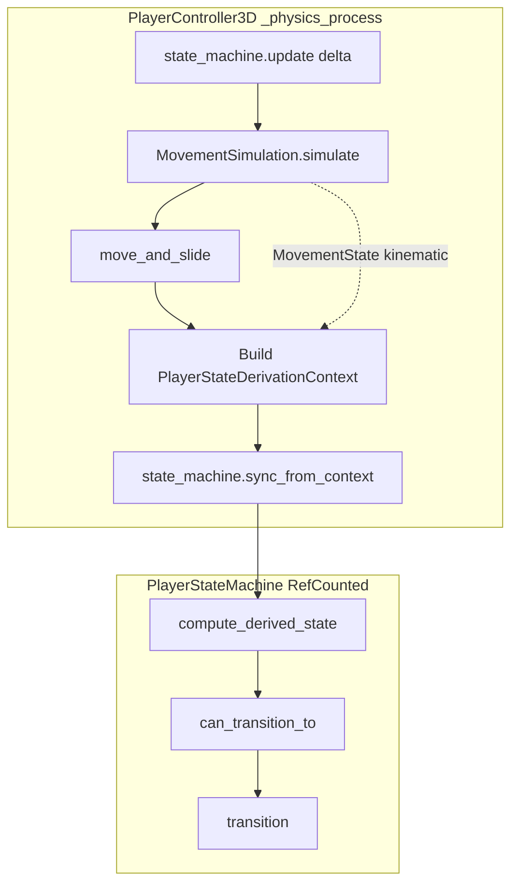

# Player State Machine Specification

**Ticket:** M11-01 — `01_player_state_machine.md`  
**Milestone:** M11 Base Mutation Attacks (Prerequisite)  
**Spec revision:** 1  
**Spec exit type:** `generic`  
**Normative ID prefix:** `PSM-*`

---

## Document Summary

Introduce `PlayerStateMachine` (`scripts/player/player_state_machine.gd`) as a **RefCounted gameplay FSM** owned by `PlayerController3D`. The FSM codifies ten gameplay states currently implied by velocity, floor contact, wall cling, chunk-stuck, mutation, damage, and HP signals. **Gameplay behavior must not change**; existing M1 tests and the full suite remain the regression contract.

This spec deliberately separates:

| Layer | Type | Owner | Purpose |
|-------|------|-------|---------|
| **Kinematic snapshot** | `MovementSimulation.MovementState` (inner class) | `MovementSimulation.simulate()` | Velocity, floor, coyote, wall cling flags, HP field used by sim |
| **Gameplay FSM** | `PlayerStateMachine.PlayerState` (enum) | `PlayerStateMachine` | High-level player mode for animation, input gating (downstream M11), minimum action durations |

**Never** alias, cast, or compare `MovementSimulation.MovementState` to `PlayerStateMachine.PlayerState`.

---

## Deferred Boundary Statement

**In scope (M11-01):**

- RefCounted FSM module + controller wiring + headless unit tests.
- Derivation rules that mirror **current** observable behavior.
- `state_timer` contract and minimum-duration hooks (constants frozen; zero-duration HURT preserves today).
- Public accessor on `PlayerController3D` for downstream M11 tickets.

**Out of scope (deferred to later M11 tickets):**

- Attack-specific states: `CHARGE_UP`, `ABILITY_USE`, `INHALE`, `INHALE_HOLD`, `SWALLOW`, `SPIT`, `CROUCH` (listed in `INTEGRATION_ROADMAP.md` for future enrichment only).
- Hold-to-float input and float physics changes.
- `_physics_process` frame reorder (`state_machine.update` as step 1) — **M11-02**; this ticket documents the hook point only.
- Input gating for abilities/attacks.
- Death/restart coordinator changes beyond calling `reset()` on the FSM when HP is restored.
- Modifications to `MovementSimulation` or `MovementState`.

---

## Test Strategy

| Tier | Location | Scope |
|------|----------|-------|
| **Primary unit** | `tests/scripts/player/test_player_state_machine.gd` | Pure `PlayerStateMachine.new()` — enum coverage, `can_transition_to`, `transition`, `update`, `state_timer`, `reset`, derivation helper (if on FSM), damage notification |
| **Adversarial unit** | `tests/scripts/player/test_player_state_machine_adversarial.gd` | DEAD terminal, double HURT denial, invalid FLOAT sources, timer epsilon edges, `MovementState` naming isolation |
| **Regression** | Full suite | `timeout 300 ci/scripts/run_tests.sh` exits 0 — no M1 behavior change |

**Test realism rules:**

- Assert runtime FSM API behavior only. Do **not** assert markdown/spec prose.
- Instantiate via `PlayerStateMachine.new()`; no scene tree required for unit tests.
- Controller integration tests are **optional** unless a wiring regression is not covered by the full suite; primary gate is `run_tests.sh`.

**Registration:** Both test files must be registered in `tests/run_tests.gd`.

---

## Edge Cases (Summary)

| ID | Case | Expected behavior |
|----|------|-------------------|
| EC-1 | `transition(DEAD)` then any other state | Denied until `reset()` |
| EC-2 | `notify_damage_taken()` twice same frame | Second HURT transition denied |
| EC-3 | HP crosses to 0 mid-air | DEAD overrides JUMP/FALL derivation |
| EC-4 | Chunk stuck + mutation active | ABSORB wins over MUTATE (priority 3 > 4) |
| EC-5 | Wall cling ends same frame as landing | Derivation picks floor kinematic state (IDLE/WALK) when `is_wall_clinging == false` |
| EC-6 | `transition` to same state | Allowed no-op; `state_timer` **not** reset |
| EC-7 | `update(0.0)` | `state_timer` unchanged (adds 0) |
| EC-8 | `reset()` from DEAD | Returns to IDLE, timer 0, hurt latch cleared |
| EC-9 | Explicit `transition(FLOAT)` from IDLE | Denied by guard |
| EC-10 | `min_hp` < `current_hp` after damage | HURT may flash; DEAD not entered |

---

# Requirements

---

## Requirement PSM-1: Module Identity and Dependencies

### 1. Spec Summary

- **Description:** Create `PlayerStateMachine` as a pure logic module: `class_name PlayerStateMachine`, `extends RefCounted`. No `Node`, scene, or `Input` dependencies. Module may `preload` nothing from engine gameplay scenes.
- **Constraints:** Single file: `scripts/player/player_state_machine.gd`. Follow `EnemyStateMachine` / `SceneStateMachine` patterns (pure RefCounted, headless-testable).
- **Assumptions:** Godot 4.x GDScript with `class_name` registration.
- **Scope:** New file only; no changes to movement simulation in this requirement.

### 2. Acceptance Criteria

- **AC-PSM-1.1:** `PlayerStateMachine.new()` succeeds in headless context (non-null).
- **AC-PSM-1.2:** Script declares `class_name PlayerStateMachine` and `extends RefCounted`.
- **AC-PSM-1.3:** No `extends Node` and no autoload/singleton pattern.

### 3. Risk & Ambiguity Analysis

- **R-PSM-1.1:** Accidental Node coupling breaks unit-test isolation. Tests must construct without scene tree.

### 4. Clarifying Questions

None.

---

## Requirement PSM-2: PlayerState Enum

### 1. Spec Summary

- **Description:** Inner enum `PlayerState` lists exactly ten gameplay states matching ticket AC.
- **Constraints:** Enum name `PlayerState` nested in `PlayerStateMachine`. Members and explicit integer values:

```gdscript
enum PlayerState {
	IDLE = 0,
	WALK = 1,
	JUMP = 2,
	FALL = 3,
	FLOAT = 4,
	WALL_CLING = 5,
	ABSORB = 6,
	MUTATE = 7,
	HURT = 8,
	DEAD = 9,
}
```

- **Assumptions:** No additional enum members in M11-01.
- **Scope:** Enum definition and `get_state() -> PlayerState`.

### 2. Acceptance Criteria

- **AC-PSM-2.1:** Enum contains exactly the ten members above; no `CHARGE_UP`, `ABILITY_USE`, or other attack states.
- **AC-PSM-2.2:** Fresh machine `get_state()` returns `PlayerState.IDLE`.
- **AC-PSM-2.3:** Tests can iterate all enum values; count == 10.

### 3. Risk & Ambiguity Analysis

- **R-PSM-2.1:** Name collision with `MovementSimulation.MovementState` class. Spec forbids conflation; tests should use fully qualified `PlayerStateMachine.PlayerState`.

### 4. Clarifying Questions

None.

---

## Requirement PSM-3: State Timer Contract

### 1. Spec Summary

- **Description:** Track time spent in the **current** state via `state_timer` (seconds, `float`).
- **Constraints:**
  - `update(delta: float) -> void` adds `maxf(0.0, delta)` to `state_timer` every call.
  - On successful transition to a **different** state, reset `state_timer` to `0.0`.
  - Transition to the **same** state is a no-op: state and timer unchanged.
  - Expose `get_state_timer() -> float` (preferred) or public `var state_timer` with documented read-only intent for external callers.
- **Assumptions:** Controller calls `update(delta)` once per `_physics_process` (M11-02 may move call order; timer semantics unchanged).
- **Scope:** Timer fields and `update`.

### 2. Acceptance Criteria

- **AC-PSM-3.1:** After `PlayerStateMachine.new()`, `get_state_timer() == 0.0`.
- **AC-PSM-3.2:** After `update(0.016)` twice, timer == `0.032` (±1e-4) with no transition.
- **AC-PSM-3.3:** After `transition(WALK)` from IDLE, timer == `0.0`.
- **AC-PSM-3.4:** After `transition(IDLE)` while already IDLE, timer continues accumulating across subsequent `update` calls.
- **AC-PSM-3.5:** `update(0.0)` does not change timer.

### 3. Risk & Ambiguity Analysis

- **R-PSM-3.1:** Double `update` per frame doubles timer rate. Controller must call exactly once per physics tick (documented in PSM-9).

### 4. Clarifying Questions

None.

---

## Requirement PSM-4: Transition Guards (`can_transition_to`)

### 1. Spec Summary

- **Description:** `can_transition_to(new_state: PlayerState) -> bool` evaluates whether `transition(new_state)` would succeed (excluding same-state no-op, which always succeeds).
- **Constraints — denial rules (strictest defensible):**

| Rule | Condition | Result |
|------|-----------|--------|
| **G-DEAD** | Current state is `DEAD` and `new_state != DEAD` | `false` |
| **G-HURT** | `new_state == HURT` and current is `HURT` or `DEAD` | `false` |
| **G-FLOAT** | `new_state == FLOAT` and current not in `{JUMP, FALL, FLOAT}` | `false` |
| **G-OPEN** | All other pairs | `true` |

- **Notes:**
  - Transition **to** `DEAD` is always allowed from any non-terminal evaluation (death overrides).
  - `FLOAT` minimum-duration gate (PSM-6) is checked inside `transition`, not `can_transition_to`, when `new_state == FLOAT` and current == `JUMP`.
- **Assumptions:** No other denials in M11-01.
- **Scope:** Guard logic only.

### 2. Acceptance Criteria

- **AC-PSM-4.1:** From `DEAD`, `can_transition_to(IDLE)` is `false`.
- **AC-PSM-4.2:** From `HURT`, `can_transition_to(HURT)` is `false`.
- **AC-PSM-4.3:** From `IDLE`, `can_transition_to(FLOAT)` is `false`.
- **AC-PSM-4.4:** From `JUMP`, `can_transition_to(FLOAT)` is `true`.
- **AC-PSM-4.5:** From `WALK`, `can_transition_to(DEAD)` is `true`.

### 3. Risk & Ambiguity Analysis

- **R-PSM-4.1:** Overly permissive guards break downstream attack gating. Test Breaker should encode denials above.

### 4. Clarifying Questions

None.

---

## Requirement PSM-5: Transition Application (`transition`)

### 1. Spec Summary

- **Description:** `transition(new_state: PlayerState) -> bool` applies guarded state changes.
- **Constraints:**
  1. If `new_state == get_state()`: return `true`; no mutation.
  2. If not `can_transition_to(new_state)`: return `false`; no mutation.
  3. If `new_state == FLOAT`, current == `JUMP`, and `get_state_timer() < MIN_FLOAT_FROM_JUMP_SEC` (PSM-6): return `false`; no mutation.
  4. Otherwise: set state to `new_state`, reset `state_timer` to `0.0`, return `true`.
- **Assumptions:** Optional debug logging via `print`/`push_warning` is allowed but **not** part of the observable contract.
- **Scope:** `transition` implementation.

### 2. Acceptance Criteria

- **AC-PSM-5.1:** Denied transition leaves prior state and timer unchanged.
- **AC-PSM-5.2:** Allowed transition updates `get_state()` and zeroes timer.
- **AC-PSM-5.3:** Return value matches success/failure of rules in Constraints.

### 3. Risk & Ambiguity Analysis

- **R-PSM-5.1:** Silent failure vs assert — return `false` (matches conservative enemy FSM no-op style).

### 4. Clarifying Questions

None.

---

## Requirement PSM-6: Minimum Action Duration Constants

### 1. Spec Summary

- **Description:** Freeze duration constants for future gating; only FLOAT-from-JUMP gate is enforced in `transition` when FLOAT is explicitly requested.
- **Constraints:**

| Constant | Value | Usage in M11-01 |
|----------|-------|-----------------|
| `MIN_FLOAT_FROM_JUMP_SEC` | `0.05` | Blocks `transition(FLOAT)` from `JUMP` until timer ≥ 0.05 |
| `MIN_HURT_SEC` | `0.0` | HURT exits on next derivation once latch consumed (behavior-preserving) |

- **Assumptions:** No hold-to-float input exists; FLOAT is not auto-derived (PSM-7).
- **Scope:** Constants on `PlayerStateMachine` (module-level `const`).

### 2. Acceptance Criteria

- **AC-PSM-6.1:** From `JUMP` with timer `0.04`, `transition(FLOAT)` returns `false`.
- **AC-PSM-6.2:** From `JUMP` with timer `0.05`, `transition(FLOAT)` returns `true`.
- **AC-PSM-6.3:** `MIN_HURT_SEC == 0.0` documented and test-visible.

### 3. Risk & Ambiguity Analysis

- **R-PSM-6.1:** Downstream M11 may raise `MIN_HURT_SEC`; constant must be named and centralized.

### 4. Clarifying Questions

None.

---

## Requirement PSM-7: Derivation Context and Target State

### 1. Spec Summary

- **Description:** Provide a pure derivation entry point so controller and tests share one ruleset:

```gdscript
class_name PlayerStateDerivationContext
extends RefCounted

var is_on_floor: bool = false
var horizontal_speed: float = 0.0       # abs(velocity.x) in m/s (3D body)
var vertical_velocity: float = 0.0      # velocity.y in m/s; up positive
var move_speed_threshold: float = 0.12    # matches PlayerExportAnimationController3D default
var is_wall_clinging: bool = false
var is_any_chunk_stuck: bool = false
var is_mutation_active: bool = false      # any_filled() OR fusion_active
var current_hp: float = 100.0
var min_hp: float = 0.0
var hurt_pending: bool = false            # latched by notify_damage_taken()
```

`PlayerStateMachine.compute_derived_state(ctx: PlayerStateDerivationContext) -> PlayerState` returns the **target** gameplay state from signals. **Priority order (first match wins):**

1. **DEAD** — `ctx.current_hp <= ctx.min_hp`
2. **HURT** — `ctx.hurt_pending == true` and not dead
3. **ABSORB** — `ctx.is_any_chunk_stuck == true`
4. **MUTATE** — `ctx.is_mutation_active == true`
5. **WALL_CLING** — `ctx.is_wall_clinging == true`
6. **Air kinematic** — `ctx.is_on_floor == false`:
   - **JUMP** if `ctx.vertical_velocity > VERTICAL_JUMP_EPSILON` (`0.01` m/s)
   - else **FALL**
7. **Ground kinematic** — `ctx.is_on_floor == true`:
   - **WALK** if `ctx.horizontal_speed > ctx.move_speed_threshold`
   - else **IDLE**

**FLOAT** is never returned by `compute_derived_state` in M11-01. Entering FLOAT requires explicit `transition(FLOAT)` (future input ticket).

- **Constraints:** `PlayerStateDerivationContext` may live in the same file as `PlayerStateMachine` or a sibling `player_state_derivation_context.gd` RefCounted — prefer same file unless line count forces split.
- **Assumptions:** Derivation mirrors `PlayerExportAnimationController3D.clip_base_for_state` for floor/air split (idle vs move vs jump), extended with wall cling and gameplay overlays present in `PlayerController3D` today.
- **Scope:** Context type + static/instance derivation function.

### 2. Acceptance Criteria

- **AC-PSM-7.1:** Floor + low speed → `IDLE`.
- **AC-PSM-7.2:** Floor + speed `0.2` + threshold `0.12` → `WALK`.
- **AC-PSM-7.3:** Air + `vertical_velocity = 0.5` → `JUMP`.
- **AC-PSM-7.4:** Air + `vertical_velocity = -0.5` → `FALL`.
- **AC-PSM-7.5:** `is_wall_clinging` true (and no higher priority) → `WALL_CLING`.
- **AC-PSM-7.6:** `is_any_chunk_stuck` true → `ABSORB` even if mutation active.
- **AC-PSM-7.7:** `current_hp = 0`, `min_hp = 0` → `DEAD`.
- **AC-PSM-7.8:** Derivation never returns `FLOAT`.

### 3. Risk & Ambiguity Analysis

- **R-PSM-7.1:** ABSORB vs MUTATE priority affects animation/readability. ABSORB chosen because chunk-on-enemy is the dominant infection-loop signal today.
- **R-PSM-7.2:** HURT at zero duration may be unobservable in gameplay; still required for API/downstream gating tests.

### 4. Clarifying Questions

None — resolved in planning checkpoint (ABSORB > MUTATE, HURT zero-duration).

---

## Requirement PSM-8: Damage Notification and Hurt Latch

### 1. Spec Summary

- **Description:** `notify_damage_taken() -> void` sets an internal `_hurt_pending` latch consumed by the next `sync_from_context(ctx)` call (see PSM-9). Latch clears after a successful transition **to** `HURT` or when derivation selects a non-HURT state because HP is DEAD.
- **Constraints:** Calling `notify_damage_taken()` while already in `HURT` does not re-arm latch (double-HURT same frame is no-op at latch level; transition guard G-HURT also blocks).
- **Assumptions:** Controller calls `notify_damage_taken()` from `take_damage()` and from acid DoT paths that reduce HP (same as today’s damage semantics).
- **Scope:** Hurt latch API.

### 2. Acceptance Criteria

- **AC-PSM-8.1:** After `notify_damage_taken()`, next sync with non-dead HP yields target `HURT`.
- **AC-PSM-8.2:** Second `notify_damage_taken()` before sync does not extend HURT if already in `HURT`.
- **AC-PSM-8.3:** With `MIN_HURT_SEC == 0.0`, after sync+derivation on following frame with no new damage, state follows kinematic rules (not stuck in HURT).

### 3. Risk & Ambiguity Analysis

- **R-PSM-8.1:** Acid DoT tick may spam damage; each tick calls `notify_damage_taken()` but G-HURT blocks re-entry while already HURT — consistent with conservative gating.

### 4. Clarifying Questions

None.

---

## Requirement PSM-9: Sync Helper and Reset

### 1. Spec Summary

- **Description:**
  - `sync_from_context(ctx: PlayerStateDerivationContext) -> void` computes `target = compute_derived_state(ctx)`, then calls `transition(target)`. Clears hurt latch when transition to `HURT` succeeds or when target is `DEAD`.
  - `reset() -> void` sets state to `IDLE`, timer to `0.0`, clears hurt latch.
- **Constraints:** `reset()` is the **only** way to leave `DEAD` besides constructing a new instance.
- **Assumptions:** `DeathRestartCoordinator` path calls `reset_hp()` on controller; controller must call `_state_machine.reset()` (or equivalent) when HP restored after death.
- **Scope:** Sync + reset APIs.

### 2. Acceptance Criteria

- **AC-PSM-9.1:** `reset()` from `DEAD` yields `IDLE`.
- **AC-PSM-9.2:** `sync_from_context` never throws; uses `transition` guards.
- **AC-PSM-9.3:** After death (`DEAD`), sync with revived HP context without `reset()` keeps `DEAD` (G-DEAD).

### 3. Risk & Ambiguity Analysis

- **R-PSM-9.1:** Forgetting `reset()` on revive leaves player in DEAD. Controller integration must wire `reset_hp()`.

### 4. Clarifying Questions

None.

---

## Requirement PSM-10: PlayerController3D Integration

### 1. Spec Summary

- **Description:** Wire FSM into `PlayerController3D` without changing movement simulation or M1 behavior.
- **Constraints:**
  - Add `var _player_state_machine: PlayerStateMachine` (or `_state_machine` if no naming conflict — prefer `_player_state_machine` to avoid confusion with `_current_state: MovementSimulation.MovementState`).
  - `_ready()`: `_player_state_machine = PlayerStateMachine.new()`.
  - Each `_physics_process(delta)`:
    1. **Hook point (M11-02):** `_player_state_machine.update(delta)` — call once at current insertion point (after input read, before or after sim per minimal-diff rule; **must** occur exactly once per tick).
    2. After `move_and_slide()` and `_current_state` kinematic copy-back, build `PlayerStateDerivationContext` from:
       - `is_on_floor()` / `velocity` (3D m/s)
       - `_current_state.is_wall_clinging`
       - `any(_chunk_stuck)` 
       - `_fusion_active` or mutation slot `any_filled()` / `is_filled()`
       - `_current_state.current_hp`, `_simulation.min_hp`
       - hurt latch via prior `notify_damage_taken()` calls
    3. `_player_state_machine.sync_from_context(ctx)`
  - `take_damage()` / acid DoT HP reduction: call `_player_state_machine.notify_damage_taken()` before sync on that frame (or immediately when damage applied, sync at end of frame as today).
  - `reset_hp()`: call `_player_state_machine.reset()` after restoring HP.
  - Replace implicit gameplay state checks with FSM:
    - `is_wall_clinging_state()` returns `_player_state_machine.get_state() == PlayerStateMachine.PlayerState.WALL_CLING` (may still read cling flag for sim; public API uses FSM).
  - Add accessors:
    - `get_player_state() -> PlayerStateMachine.PlayerState`
    - `get_player_state_machine() -> PlayerStateMachine` (for downstream M11)
- **Assumptions:** No unrelated controller refactors. `MovementSimulation.simulate()` signature and call unchanged.
- **Scope:** `scripts/player/player_controller_3d.gd` only for integration requirement.

### 2. Acceptance Criteria

- **AC-PSM-10.1:** Controller compiles; headless tests pass.
- **AC-PSM-10.2:** `get_player_state()` reflects derivation after `_physics_process` (test via unit/integration as feasible).
- **AC-PSM-10.3:** `is_wall_clinging_state()` consistent with FSM `WALL_CLING` when cling active.
- **AC-PSM-10.4:** Full suite `timeout 300 ci/scripts/run_tests.sh` exits 0.

### 3. Risk & Ambiguity Analysis

- **R-PSM-10.1:** Large diff risk — integration limited to FSM wiring and accessor replacements only.
- **R-PSM-10.2:** Timer double-advance if both controller and another system call `update`. Single call site enforced.

### 4. Clarifying Questions

None.

---

## Requirement PSM-11: Future States (Informational)

### 1. Spec Summary

- **Description:** Document states **not** in M11-01 enum but referenced by roadmap for later tickets: `CHARGE_UP`, `ABILITY_USE`, `INHALE`, `INHALE_HOLD`, `SWALLOW`, `SPIT`, `CROUCH`.
- **Constraints:** Must not appear in enum or transition matrix implementation.
- **Assumptions:** M11 core adds attack states with separate ticket.
- **Scope:** Documentation only.

### 2. Acceptance Criteria

- **AC-PSM-11.1:** Implementation enum count remains 10.

### 3. Risk & Ambiguity Analysis

None.

### 4. Clarifying Questions

None.

---

## Non-Functional Requirements

| ID | Requirement |
|----|-------------|
| NFR-1 | **Behavior preservation:** No change to movement speeds, jump height, damage amounts, chunk flow, or death timing observable in existing tests. |
| NFR-2 | **Determinism:** Given identical context sequences, derivation and transitions are deterministic. |
| NFR-3 | **Performance:** FSM work O(1) per physics frame; no allocations in hot path after `_ready()` (reuse context object optional). |
| NFR-4 | **Typing:** GDScript typed members and signatures throughout new module. |
| NFR-5 | **Static QA:** Changed `.gd` files pass `task hooks:gd-review`. |
| NFR-6 | **Layer separation:** No rename of `MovementSimulation.MovementState`. |

---

## AC Traceability Matrix (Ticket → Spec)

| Ticket AC | Spec coverage |
|-----------|---------------|
| RefCounted state machine class | PSM-1 |
| All ten states enumerated | PSM-2 |
| Transition rules enforced | PSM-4, PSM-5 |
| PlayerController3D uses FSM for state checks | PSM-10 |
| State timer increment/reset | PSM-3 |
| M1 tests / run_tests.sh exit 0 | PSM-10 AC-PSM-10.4, NFR-1 |
| No attack states yet | PSM-2, PSM-11, Deferred Boundary |
| Minimum action durations via state_timer | PSM-3, PSM-6 |

---

## Data Flow (Reference)



---

## Reference Files (Read-Only)

| File | Role |
|------|------|
| `scripts/player/player_controller_3d.gd` | Integration target |
| `scripts/movement/movement_simulation.gd` | Kinematic layer — do not conflate |
| `scripts/enemy/enemy_state_machine.gd` | RefCounted FSM pattern |
| `scripts/player/player_export_animation_controller_3d.gd` | Idle/walk/jump derivation mirror |
| `scripts/system/death_restart_coordinator.gd` | HP ≤ 0 death flow |
| `tests/scripts/enemy/test_enemy_state_machine.gd` | Unit test pattern |
